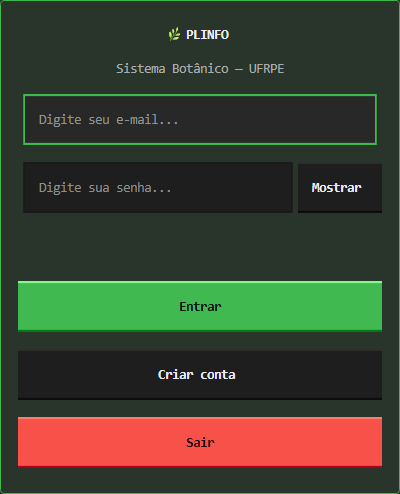
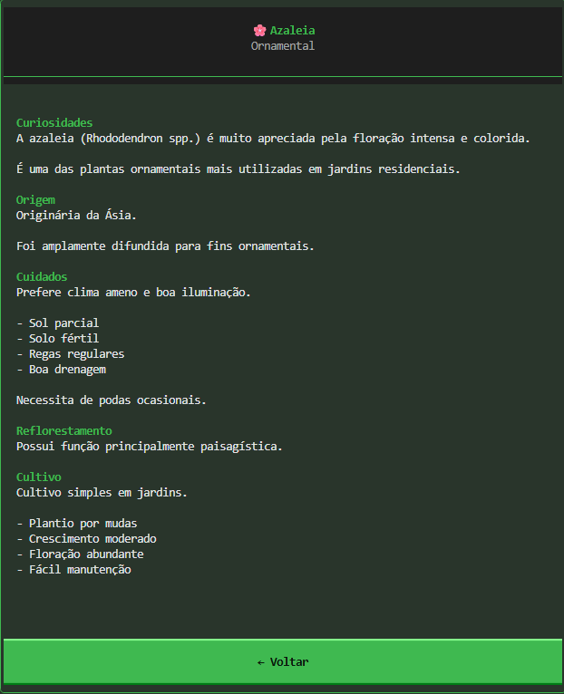
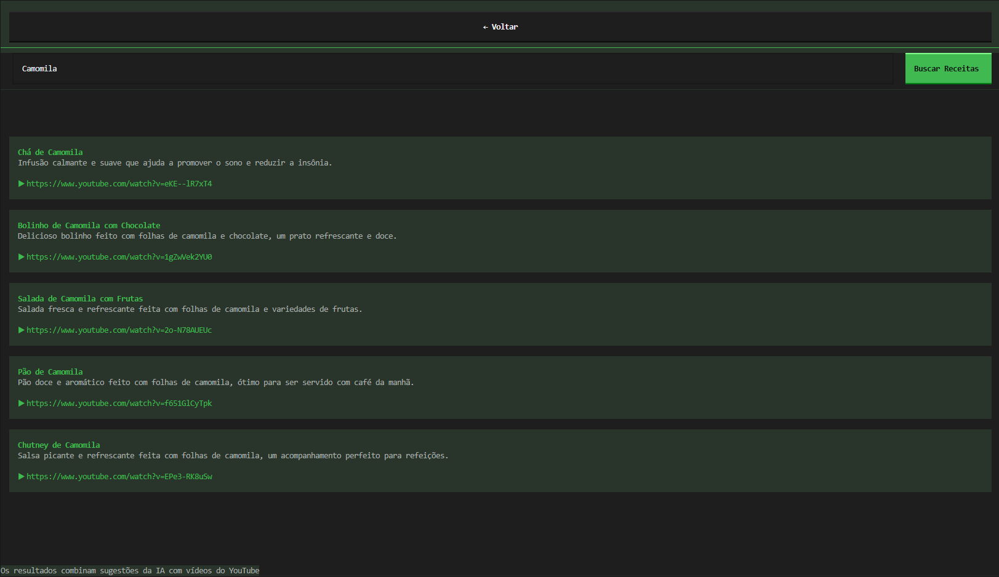
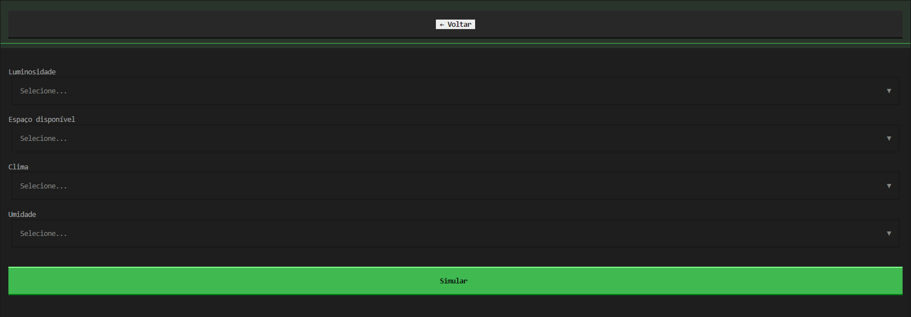

🌿 PLINFO Release 2.0

  

  <strong>Sistema de Informações Botânicas com Inteligência Artificial</strong>

  Desenvolvido por Renato Rodrigues e Pedro Coutinho

⸻

📖 Sobre o Projeto

O PLINFO (Plant Information System) é um sistema desenvolvido com o objetivo de auxiliar estudantes, produtores, pesquisadores e entusiastas da área agrícola no acesso a informações relacionadas ao cultivo de plantas, identificação de pragas e obtenção de recomendações inteligentes para o manejo agrícola.

A plataforma reúne informações botânicas, recursos de busca avançada, catálogo de pragas, simulador de ambientes e integração com Inteligência Artificial para geração de receitas e recomendações relacionadas às espécies cadastradas.

O projeto foi desenvolvido utilizando a linguagem Python e segue uma arquitetura orientada a objetos, proporcionando maior organização, escalabilidade e facilidade de manutenção.

⸻

🎯 Objetivos

* Centralizar informações sobre espécies vegetais.
* Facilitar a consulta de dados botânicos.
* Auxiliar na identificação de pragas.
* Disponibilizar recomendações de prevenção e tratamento.
* Oferecer recursos multimídia para aprendizado.
* Utilizar Inteligência Artificial para geração de receitas e conteúdos relacionados às plantas.
* Simular condições ambientais ideais para cultivo.

⸻

🚀 Funcionalidades

👤 Gerenciamento de Usuários

* Cadastro de usuários.
* Sistema de login.
* Verificação por e-mail.
* Gerenciamento de conta.
* Configuração de perfil.

🌱 Catálogo de Plantas

* Listagem de espécies vegetais.
* Busca por nome.
* Filtros avançados.
* Informações detalhadas das plantas.
* Linha do tempo de crescimento.
* Recomendações de cultivo.

🐛 Catálogo de Pragas

* Consulta de pragas agrícolas.
* Identificação por sintomas.
* Métodos de prevenção.
* Métodos de tratamento.
* Conteúdos educativos.

🤖 Inteligência Artificial

* Geração de receitas utilizando IA.
* Sugestões baseadas na planta selecionada.
* Respostas contextualizadas por meio da API Groq.

🎥 Integração com YouTube

* Busca automática de vídeos relacionados.
* Conteúdo educativo complementar.
* Receitas em vídeo.
* Vídeos explicativos sobre pragas.

🌡️ Simulador de Ambiente

* Simulação de condições ideais de cultivo.
* Análise de temperatura.
* Análise de umidade.
* Recomendações para desenvolvimento saudável das plantas.

⸻

🏗️ Arquitetura do Projeto

O sistema segue uma arquitetura modular baseada em Programação Orientada a Objetos.

PLINFO/
│
├── app.py
├── main.py
│
├── data/
│   ├── lista_planta.py
│   └── lista_praga.py
│
├── database/
│   └── __database.py
│
├── models/
│   └── user.py
│
├── services/
│   ├── login.py
│   ├── register.py
│   ├── recipe_service.py
│   ├── simulator.py
│   ├── user_config_service.py
│   └── youtube_service.py
│
├── ui/
│   ├── screens/
│   └── modals/
│
└── docs/
    └── screenshots/

⸻

🛠️ Tecnologias Utilizadas

Linguagem de Programação

* Python 3

Interface Gráfica

* Textual

Banco de Dados

* SQLite

APIs e Serviços

* Groq API
* YouTube Data API
* SMTP (envio de e-mails)

Configuração

* Python Dotenv

⸻

📷 Demonstração do Sistema

🌱 Consulta de Plantas

  

⸻

🤖 Receitas Geradas por Inteligência Artificial

  

⸻

🌡️ Simulador de Ambiente

  

⸻

📦 Instalação

1. Clonar o repositório

git clone https://github.com/seu-usuario/plinfo.git

2. Acessar o diretório

cd plinfo

3. Criar ambiente virtual

python -m venv venv

4. Ativar ambiente virtual

Windows

venv\Scripts\activate

Linux/macOS

source venv/bin/activate

5. Instalar dependências

pip install -r requirements.txt

6. Configurar variáveis de ambiente

Criar um arquivo .env contendo:

GROQ_API_KEY=SUA_CHAVE
YOUTUBE_API_KEY=SUA_CHAVE
EMAIL=SUA_CONTA
EMAIL_PASSWORD=SUA_SENHA

7. Executar o sistema

python main.py

⸻

📈 Evolução do Projeto

Release 1.0

* Sistema de cadastro.
* Sistema de login.
* Verificação por e-mail.
* Catálogo inicial de plantas.
* Busca básica.
* Informações detalhadas das espécies.
* Gerenciamento de conta.

Release 2.0

* Migração completa para Programação Orientada a Objetos.
* Migração para interface Textual.
* Ampliação do catálogo para mais de 50 espécies.
* Novos filtros de pesquisa.
* Busca avançada.
* Integração com Inteligência Artificial.
* Integração com YouTube.
* Catálogo de pragas.
* Tratamentos e prevenções.
* Simulador de ambiente.
* Linha do tempo de crescimento das plantas.

⸻

🎓 Aplicação Acadêmica

O PLINFO foi desenvolvido como projeto acadêmico com foco na aplicação de conceitos de:

* Programação Orientada a Objetos.
* Estruturas de Dados.
* Engenharia de Software.
* Integração com APIs.
* Desenvolvimento de Interfaces.
* Persistência de Dados.
* Inteligência Artificial Aplicada.

⸻

👨‍💻 Autores

Renato Rodrigues

Desenvolvimento do sistema, arquitetura, integração com APIs, banco de dados, interface gráfica e documentação.

Pedro Coutinho

Desenvolvimento, modelagem de requisitos, testes e validação do sistema.

⸻

📄 Licença

Este projeto foi desenvolvido para fins acadêmicos e educacio
